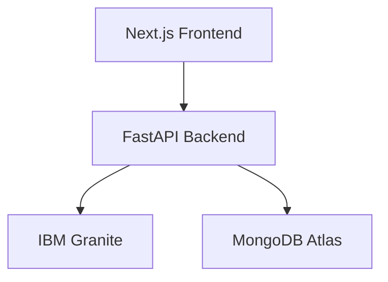

<div align="center">

# 🌌 Lumora AI

### **Create Beyond Imagination with AI**

*An AI-powered creative workspace that transforms ideas into stories, characters, worlds, and immersive creative experiences using IBM Granite.*

<p align="center">


</p>

### 🚀 IBM SkillsBuild AI Builders Challenge 2026

**Theme:** Creative Industries

*"Where imagination meets intelligent creation."*

</div>

---

# 📑 Table of Contents

- Overview
- Problem Statement
- Why Lumora AI?
- Features
- Workflow
- Architecture
- Tech Stack
- IBM Bob Contribution
- IBM Granite Integration
- Project Structure
- Screenshots
- Installation
- Environment Variables
- Future Scope
- Challenge Alignment
- Team
- License

---

# 📖 Overview

Lumora AI is an AI-powered creative workspace that helps creators transform a single idea into structured stories, memorable characters, immersive worlds, and organized creative projects.

Instead of switching between multiple disconnected AI tools, Lumora AI provides one unified creative environment where ideation, organization, and AI assistance work together seamlessly.

Whether you're a writer, game developer, filmmaker, designer, educator, or content creator, Lumora AI serves as your intelligent creative partner.

---

# ❗ Problem Statement

Creative professionals often struggle with fragmented workflows.

Generating stories, brainstorming ideas, designing characters, organizing assets, and maintaining consistency typically requires several different tools.

This results in:

- Creative blocks
- Constant context switching
- Slower production
- Lost ideas
- Inconsistent creative direction

Creators need an AI partner that understands the creative process rather than simply generating text.

---

# 💜 Why Lumora AI?

Unlike traditional AI chatbots, Lumora AI provides a structured creative workspace.

It helps users:

- Develop ideas
- Organize projects
- Build consistent characters
- Generate immersive worlds
- Collaborate with AI throughout the creative journey

---

# ✨ Features

- 🧠 AI Story Generation
- 👤 Character Creator
- 🌍 World Builder
- 📚 Creative Workspace
- 💾 Project Management
- 🔒 Secure Authentication
- ⚡ Fast Dashboard
- 🤖 IBM Granite Integration

---

# 🔄 Workflow

```text
Idea
   │
   ▼
AI Story Generation
   │
   ▼
Character Creation
   │
   ▼
World Building
   │
   ▼
Project Workspace
   │
   ▼
Save to MongoDB
```

---

# 🏗 Architecture



---

# 🛠 Tech Stack

| Category | Technologies |
|-----------|--------------|
| Frontend | Next.js 15, React 19, TypeScript, Tailwind CSS |
| Backend | FastAPI, Python |
| Database | MongoDB Atlas, Motor |
| AI | IBM Granite |
| Development | IBM Bob |
| Deployment | Vercel, Render |

---

# 🤖 IBM Bob Contribution

IBM Bob was used as the primary AI-assisted development tool throughout the project.

It contributed to:

- Frontend development
- Backend architecture
- FastAPI APIs
- MongoDB integration
- Code optimization
- Bug fixing
- Documentation
- UI refinement

IBM Bob significantly accelerated development while maintaining a clean and modular architecture.

---

# 🧠 IBM Granite Integration

Lumora AI is architected for IBM Granite integration.

The application includes a dedicated AI service layer designed to seamlessly connect with IBM Granite Foundation Models for:

- Story Generation
- Character Creation
- World Building
- Creative Brainstorming
- Intelligent Content Expansion

Currently, AI responses are demonstrated using mock data, allowing the complete creative workflow to be tested while keeping the architecture ready for IBM Granite integration.

---

# 📂 Project Structure

```text
Lumora-AI/

├── frontend/
│   ├── src/
│   ├── app/
│   ├── components/
│   └── public/
│
├── backend/
│   ├── app/
│   ├── routes/
│   ├── models/
│   ├── services/
│   ├── database.py
│   └── main.py
│
├── assets/
├── README.md
└── LICENSE
```

---

# 📸 Screenshots

## Landing Page

> Add Screenshot Here

---

## Dashboard

> Add Screenshot Here

---

## AI Workspace

> Add Screenshot Here

---

## Story Generator

> Add Screenshot Here

---

## Character Creator

> Add Screenshot Here

---

# 🚀 Installation

## Clone the Repository

```bash
git clone https://github.com/Rupu-techu/Lumora_AI.git
```

## Frontend

```bash
cd frontend
npm install
npm run dev
```

## Backend

```bash
cd backend
pip install -r requirements.txt
uvicorn app.main:app --reload
```

---

# ⚙ Environment Variables

Create a `.env` file.

```env
MONGODB_URI=

DATABASE_NAME=

IBM_GRANITE_API_KEY=

IBM_PROJECT_ID=

IBM_REGION=
```

---

# 🎯 Future Scope

- AI Image Generation
- Storyboard Generator
- Team Collaboration
- Voice Storytelling
- AI Comics
- AI Video Script Generator
- Creative Templates
- Plugin Marketplace

---

# 🏆 Challenge Alignment

✅ Creative Industries

✅ AI Creative Partner

✅ Storytelling Platform

✅ Creative Ideation

✅ IBM Bob

✅ IBM Granite

---

# 👨‍💻 Team

**Lumora AI**

Developed by:

- Rupsha Debnath

(Add teammates here)

---

# 📜 License

This project is licensed under the MIT License.

---

<div align="center">

### ⭐ If you like Lumora AI, consider giving this repository a Star!

Made with ❤️ using IBM Bob, IBM Granite, FastAPI, MongoDB Atlas, Next.js and React.

</div>
